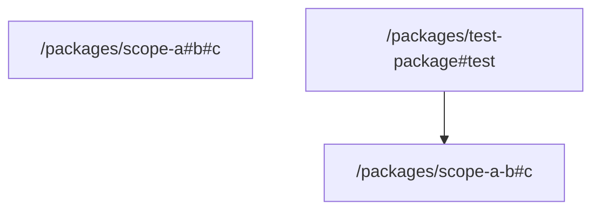

# task graph



## `<workspace>/packages/scope-a#b#c`

```json
{
  "task_display": {
    "package_name": "@test/scope-a",
    "task_name": "b#c",
    "package_path": "<workspace>/packages/scope-a"
  },
  "resolved_config": {
    "commands": [
      "echo Task b#c in scope-a"
    ],
    "resolved_options": {
      "cwd": "<workspace>/packages/scope-a",
      "cache_config": {
        "env_config": {
          "fingerprinted_envs": [],
          "untracked_env": [
            "<default untracked envs>"
          ]
        },
        "input_config": {
          "includes_auto": true,
          "positive_globs": [],
          "negative_globs": []
        },
        "output_config": {
          "includes_auto": true,
          "positive_globs": [],
          "negative_globs": []
        }
      }
    }
  },
  "source": "PackageJsonScript"
}
```

## `<workspace>/packages/scope-a-b#c`

```json
{
  "task_display": {
    "package_name": "@test/scope-a#b",
    "task_name": "c",
    "package_path": "<workspace>/packages/scope-a-b"
  },
  "resolved_config": {
    "commands": [
      "echo Task c in scope-a#b"
    ],
    "resolved_options": {
      "cwd": "<workspace>/packages/scope-a-b",
      "cache_config": {
        "env_config": {
          "fingerprinted_envs": [],
          "untracked_env": [
            "<default untracked envs>"
          ]
        },
        "input_config": {
          "includes_auto": true,
          "positive_globs": [],
          "negative_globs": []
        },
        "output_config": {
          "includes_auto": true,
          "positive_globs": [],
          "negative_globs": []
        }
      }
    }
  },
  "source": "PackageJsonScript"
}
```

## `<workspace>/packages/test-package#test`

```json
{
  "task_display": {
    "package_name": "@test/test-package",
    "task_name": "test",
    "package_path": "<workspace>/packages/test-package"
  },
  "resolved_config": {
    "commands": [
      "echo Testing"
    ],
    "resolved_options": {
      "cwd": "<workspace>/packages/test-package",
      "cache_config": {
        "env_config": {
          "fingerprinted_envs": [],
          "untracked_env": [
            "<default untracked envs>"
          ]
        },
        "input_config": {
          "includes_auto": true,
          "positive_globs": [],
          "negative_globs": []
        },
        "output_config": {
          "includes_auto": true,
          "positive_globs": [],
          "negative_globs": []
        }
      }
    }
  },
  "source": "TaskConfig"
}
```

