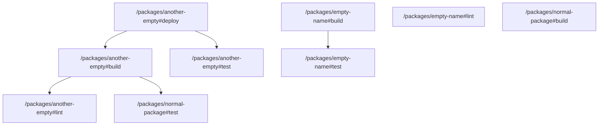

# task graph



## `<workspace>/packages/another-empty#build`

```json
{
  "task_display": {
    "package_name": "",
    "task_name": "build",
    "package_path": "<workspace>/packages/another-empty"
  },
  "resolved_config": {
    "commands": [
      "echo 'Building another-empty package'"
    ],
    "resolved_options": {
      "cwd": "<workspace>/packages/another-empty",
      "cache_config": {
        "env_config": {
          "fingerprinted_envs": [],
          "untracked_env": [
            "<default untracked envs>"
          ]
        },
        "input_config": {
          "includes_auto": true,
          "positive_globs": [],
          "negative_globs": []
        },
        "output_config": {
          "includes_auto": true,
          "positive_globs": [],
          "negative_globs": []
        }
      }
    }
  },
  "source": "TaskConfig"
}
```

## `<workspace>/packages/another-empty#deploy`

```json
{
  "task_display": {
    "package_name": "",
    "task_name": "deploy",
    "package_path": "<workspace>/packages/another-empty"
  },
  "resolved_config": {
    "commands": [
      "echo 'Deploying another-empty package'"
    ],
    "resolved_options": {
      "cwd": "<workspace>/packages/another-empty",
      "cache_config": null
    }
  },
  "source": "TaskConfig"
}
```

## `<workspace>/packages/another-empty#lint`

```json
{
  "task_display": {
    "package_name": "",
    "task_name": "lint",
    "package_path": "<workspace>/packages/another-empty"
  },
  "resolved_config": {
    "commands": [
      "echo 'Linting another-empty package'"
    ],
    "resolved_options": {
      "cwd": "<workspace>/packages/another-empty",
      "cache_config": {
        "env_config": {
          "fingerprinted_envs": [],
          "untracked_env": [
            "<default untracked envs>"
          ]
        },
        "input_config": {
          "includes_auto": true,
          "positive_globs": [],
          "negative_globs": []
        },
        "output_config": {
          "includes_auto": true,
          "positive_globs": [],
          "negative_globs": []
        }
      }
    }
  },
  "source": "TaskConfig"
}
```

## `<workspace>/packages/another-empty#test`

```json
{
  "task_display": {
    "package_name": "",
    "task_name": "test",
    "package_path": "<workspace>/packages/another-empty"
  },
  "resolved_config": {
    "commands": [
      "echo 'Testing another-empty package'"
    ],
    "resolved_options": {
      "cwd": "<workspace>/packages/another-empty",
      "cache_config": {
        "env_config": {
          "fingerprinted_envs": [],
          "untracked_env": [
            "<default untracked envs>"
          ]
        },
        "input_config": {
          "includes_auto": true,
          "positive_globs": [],
          "negative_globs": []
        },
        "output_config": {
          "includes_auto": true,
          "positive_globs": [],
          "negative_globs": []
        }
      }
    }
  },
  "source": "TaskConfig"
}
```

## `<workspace>/packages/empty-name#build`

```json
{
  "task_display": {
    "package_name": "",
    "task_name": "build",
    "package_path": "<workspace>/packages/empty-name"
  },
  "resolved_config": {
    "commands": [
      "echo 'Building empty-name package'"
    ],
    "resolved_options": {
      "cwd": "<workspace>/packages/empty-name",
      "cache_config": {
        "env_config": {
          "fingerprinted_envs": [],
          "untracked_env": [
            "<default untracked envs>"
          ]
        },
        "input_config": {
          "includes_auto": true,
          "positive_globs": [],
          "negative_globs": []
        },
        "output_config": {
          "includes_auto": true,
          "positive_globs": [],
          "negative_globs": []
        }
      }
    }
  },
  "source": "TaskConfig"
}
```

## `<workspace>/packages/empty-name#lint`

```json
{
  "task_display": {
    "package_name": "",
    "task_name": "lint",
    "package_path": "<workspace>/packages/empty-name"
  },
  "resolved_config": {
    "commands": [
      "echo 'Linting empty-name package'"
    ],
    "resolved_options": {
      "cwd": "<workspace>/packages/empty-name",
      "cache_config": {
        "env_config": {
          "fingerprinted_envs": [],
          "untracked_env": [
            "<default untracked envs>"
          ]
        },
        "input_config": {
          "includes_auto": true,
          "positive_globs": [],
          "negative_globs": []
        },
        "output_config": {
          "includes_auto": true,
          "positive_globs": [],
          "negative_globs": []
        }
      }
    }
  },
  "source": "TaskConfig"
}
```

## `<workspace>/packages/empty-name#test`

```json
{
  "task_display": {
    "package_name": "",
    "task_name": "test",
    "package_path": "<workspace>/packages/empty-name"
  },
  "resolved_config": {
    "commands": [
      "echo 'Testing empty-name package'"
    ],
    "resolved_options": {
      "cwd": "<workspace>/packages/empty-name",
      "cache_config": {
        "env_config": {
          "fingerprinted_envs": [],
          "untracked_env": [
            "<default untracked envs>"
          ]
        },
        "input_config": {
          "includes_auto": true,
          "positive_globs": [],
          "negative_globs": []
        },
        "output_config": {
          "includes_auto": true,
          "positive_globs": [],
          "negative_globs": []
        }
      }
    }
  },
  "source": "TaskConfig"
}
```

## `<workspace>/packages/normal-package#build`

```json
{
  "task_display": {
    "package_name": "normal-package",
    "task_name": "build",
    "package_path": "<workspace>/packages/normal-package"
  },
  "resolved_config": {
    "commands": [
      "echo 'Building normal-package'"
    ],
    "resolved_options": {
      "cwd": "<workspace>/packages/normal-package",
      "cache_config": {
        "env_config": {
          "fingerprinted_envs": [],
          "untracked_env": [
            "<default untracked envs>"
          ]
        },
        "input_config": {
          "includes_auto": true,
          "positive_globs": [],
          "negative_globs": []
        },
        "output_config": {
          "includes_auto": true,
          "positive_globs": [],
          "negative_globs": []
        }
      }
    }
  },
  "source": "TaskConfig"
}
```

## `<workspace>/packages/normal-package#test`

```json
{
  "task_display": {
    "package_name": "normal-package",
    "task_name": "test",
    "package_path": "<workspace>/packages/normal-package"
  },
  "resolved_config": {
    "commands": [
      "echo 'Testing normal-package'"
    ],
    "resolved_options": {
      "cwd": "<workspace>/packages/normal-package",
      "cache_config": {
        "env_config": {
          "fingerprinted_envs": [],
          "untracked_env": [
            "<default untracked envs>"
          ]
        },
        "input_config": {
          "includes_auto": true,
          "positive_globs": [],
          "negative_globs": []
        },
        "output_config": {
          "includes_auto": true,
          "positive_globs": [],
          "negative_globs": []
        }
      }
    }
  },
  "source": "TaskConfig"
}
```

