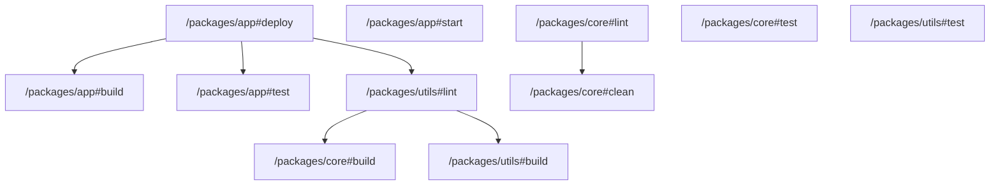

# task graph



## `<workspace>/packages/app#build`

```json
{
  "task_display": {
    "package_name": "@test/app",
    "task_name": "build",
    "package_path": "<workspace>/packages/app"
  },
  "resolved_config": {
    "commands": [
      "echo 'Building @test/app'"
    ],
    "resolved_options": {
      "cwd": "<workspace>/packages/app",
      "cache_config": {
        "env_config": {
          "fingerprinted_envs": [],
          "untracked_env": [
            "<default untracked envs>"
          ]
        },
        "input_config": {
          "includes_auto": true,
          "positive_globs": [],
          "negative_globs": []
        },
        "output_config": {
          "includes_auto": true,
          "positive_globs": [],
          "negative_globs": []
        }
      }
    }
  },
  "source": "PackageJsonScript"
}
```

## `<workspace>/packages/app#deploy`

```json
{
  "task_display": {
    "package_name": "@test/app",
    "task_name": "deploy",
    "package_path": "<workspace>/packages/app"
  },
  "resolved_config": {
    "commands": [
      "deploy-script --prod"
    ],
    "resolved_options": {
      "cwd": "<workspace>/packages/app",
      "cache_config": null
    }
  },
  "source": "TaskConfig"
}
```

## `<workspace>/packages/app#start`

```json
{
  "task_display": {
    "package_name": "@test/app",
    "task_name": "start",
    "package_path": "<workspace>/packages/app"
  },
  "resolved_config": {
    "commands": [
      "echo 'Starting @test/app'"
    ],
    "resolved_options": {
      "cwd": "<workspace>/packages/app",
      "cache_config": {
        "env_config": {
          "fingerprinted_envs": [],
          "untracked_env": [
            "<default untracked envs>"
          ]
        },
        "input_config": {
          "includes_auto": true,
          "positive_globs": [],
          "negative_globs": []
        },
        "output_config": {
          "includes_auto": true,
          "positive_globs": [],
          "negative_globs": []
        }
      }
    }
  },
  "source": "PackageJsonScript"
}
```

## `<workspace>/packages/app#test`

```json
{
  "task_display": {
    "package_name": "@test/app",
    "task_name": "test",
    "package_path": "<workspace>/packages/app"
  },
  "resolved_config": {
    "commands": [
      "echo 'Testing @test/app'"
    ],
    "resolved_options": {
      "cwd": "<workspace>/packages/app",
      "cache_config": {
        "env_config": {
          "fingerprinted_envs": [],
          "untracked_env": [
            "<default untracked envs>"
          ]
        },
        "input_config": {
          "includes_auto": true,
          "positive_globs": [],
          "negative_globs": []
        },
        "output_config": {
          "includes_auto": true,
          "positive_globs": [],
          "negative_globs": []
        }
      }
    }
  },
  "source": "PackageJsonScript"
}
```

## `<workspace>/packages/core#build`

```json
{
  "task_display": {
    "package_name": "@test/core",
    "task_name": "build",
    "package_path": "<workspace>/packages/core"
  },
  "resolved_config": {
    "commands": [
      "echo 'Building @test/core'"
    ],
    "resolved_options": {
      "cwd": "<workspace>/packages/core",
      "cache_config": {
        "env_config": {
          "fingerprinted_envs": [],
          "untracked_env": [
            "<default untracked envs>"
          ]
        },
        "input_config": {
          "includes_auto": true,
          "positive_globs": [],
          "negative_globs": []
        },
        "output_config": {
          "includes_auto": true,
          "positive_globs": [],
          "negative_globs": []
        }
      }
    }
  },
  "source": "PackageJsonScript"
}
```

## `<workspace>/packages/core#clean`

```json
{
  "task_display": {
    "package_name": "@test/core",
    "task_name": "clean",
    "package_path": "<workspace>/packages/core"
  },
  "resolved_config": {
    "commands": [
      "echo 'Cleaning @test/core'"
    ],
    "resolved_options": {
      "cwd": "<workspace>/packages/core",
      "cache_config": {
        "env_config": {
          "fingerprinted_envs": [],
          "untracked_env": [
            "<default untracked envs>"
          ]
        },
        "input_config": {
          "includes_auto": true,
          "positive_globs": [],
          "negative_globs": []
        },
        "output_config": {
          "includes_auto": true,
          "positive_globs": [],
          "negative_globs": []
        }
      }
    }
  },
  "source": "PackageJsonScript"
}
```

## `<workspace>/packages/core#lint`

```json
{
  "task_display": {
    "package_name": "@test/core",
    "task_name": "lint",
    "package_path": "<workspace>/packages/core"
  },
  "resolved_config": {
    "commands": [
      "eslint src"
    ],
    "resolved_options": {
      "cwd": "<workspace>/packages/core",
      "cache_config": {
        "env_config": {
          "fingerprinted_envs": [],
          "untracked_env": [
            "<default untracked envs>"
          ]
        },
        "input_config": {
          "includes_auto": true,
          "positive_globs": [],
          "negative_globs": []
        },
        "output_config": {
          "includes_auto": true,
          "positive_globs": [],
          "negative_globs": []
        }
      }
    }
  },
  "source": "TaskConfig"
}
```

## `<workspace>/packages/core#test`

```json
{
  "task_display": {
    "package_name": "@test/core",
    "task_name": "test",
    "package_path": "<workspace>/packages/core"
  },
  "resolved_config": {
    "commands": [
      "echo 'Testing @test/core'"
    ],
    "resolved_options": {
      "cwd": "<workspace>/packages/core",
      "cache_config": {
        "env_config": {
          "fingerprinted_envs": [],
          "untracked_env": [
            "<default untracked envs>"
          ]
        },
        "input_config": {
          "includes_auto": true,
          "positive_globs": [],
          "negative_globs": []
        },
        "output_config": {
          "includes_auto": true,
          "positive_globs": [],
          "negative_globs": []
        }
      }
    }
  },
  "source": "PackageJsonScript"
}
```

## `<workspace>/packages/utils#build`

```json
{
  "task_display": {
    "package_name": "@test/utils",
    "task_name": "build",
    "package_path": "<workspace>/packages/utils"
  },
  "resolved_config": {
    "commands": [
      "echo 'Building @test/utils'"
    ],
    "resolved_options": {
      "cwd": "<workspace>/packages/utils",
      "cache_config": {
        "env_config": {
          "fingerprinted_envs": [],
          "untracked_env": [
            "<default untracked envs>"
          ]
        },
        "input_config": {
          "includes_auto": true,
          "positive_globs": [],
          "negative_globs": []
        },
        "output_config": {
          "includes_auto": true,
          "positive_globs": [],
          "negative_globs": []
        }
      }
    }
  },
  "source": "PackageJsonScript"
}
```

## `<workspace>/packages/utils#lint`

```json
{
  "task_display": {
    "package_name": "@test/utils",
    "task_name": "lint",
    "package_path": "<workspace>/packages/utils"
  },
  "resolved_config": {
    "commands": [
      "eslint src"
    ],
    "resolved_options": {
      "cwd": "<workspace>/packages/utils",
      "cache_config": {
        "env_config": {
          "fingerprinted_envs": [],
          "untracked_env": [
            "<default untracked envs>"
          ]
        },
        "input_config": {
          "includes_auto": true,
          "positive_globs": [],
          "negative_globs": []
        },
        "output_config": {
          "includes_auto": true,
          "positive_globs": [],
          "negative_globs": []
        }
      }
    }
  },
  "source": "TaskConfig"
}
```

## `<workspace>/packages/utils#test`

```json
{
  "task_display": {
    "package_name": "@test/utils",
    "task_name": "test",
    "package_path": "<workspace>/packages/utils"
  },
  "resolved_config": {
    "commands": [
      "echo 'Testing @test/utils'"
    ],
    "resolved_options": {
      "cwd": "<workspace>/packages/utils",
      "cache_config": {
        "env_config": {
          "fingerprinted_envs": [],
          "untracked_env": [
            "<default untracked envs>"
          ]
        },
        "input_config": {
          "includes_auto": true,
          "positive_globs": [],
          "negative_globs": []
        },
        "output_config": {
          "includes_auto": true,
          "positive_globs": [],
          "negative_globs": []
        }
      }
    }
  },
  "source": "PackageJsonScript"
}
```

