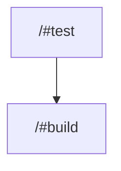

# task graph



## `<workspace>/#build`

```json
{
  "task_display": {
    "package_name": "@test/extra-args-not-forwarded-to-depends-on",
    "task_name": "build",
    "package_path": "<workspace>/"
  },
  "resolved_config": {
    "commands": [
      "vt tool print build"
    ],
    "resolved_options": {
      "cwd": "<workspace>/",
      "cache_config": {
        "env_config": {
          "fingerprinted_envs": [],
          "untracked_env": [
            "<default untracked envs>"
          ]
        },
        "input_config": {
          "includes_auto": true,
          "positive_globs": [],
          "negative_globs": []
        },
        "output_config": {
          "includes_auto": true,
          "positive_globs": [],
          "negative_globs": []
        }
      }
    }
  },
  "source": "TaskConfig"
}
```

## `<workspace>/#test`

```json
{
  "task_display": {
    "package_name": "@test/extra-args-not-forwarded-to-depends-on",
    "task_name": "test",
    "package_path": "<workspace>/"
  },
  "resolved_config": {
    "commands": [
      "vt tool print test"
    ],
    "resolved_options": {
      "cwd": "<workspace>/",
      "cache_config": {
        "env_config": {
          "fingerprinted_envs": [],
          "untracked_env": [
            "<default untracked envs>"
          ]
        },
        "input_config": {
          "includes_auto": true,
          "positive_globs": [],
          "negative_globs": []
        },
        "output_config": {
          "includes_auto": true,
          "positive_globs": [],
          "negative_globs": []
        }
      }
    }
  },
  "source": "TaskConfig"
}
```

