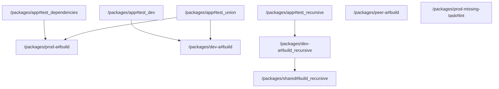

# task graph



## `<workspace>/packages/app#test_dependencies`

```json
{
  "task_display": {
    "package_name": "@test/app",
    "task_name": "test_dependencies",
    "package_path": "<workspace>/packages/app"
  },
  "resolved_config": {
    "commands": [
      "vtt test dependencies"
    ],
    "resolved_options": {
      "cwd": "<workspace>/packages/app",
      "cache_config": {
        "env_config": {
          "fingerprinted_envs": [],
          "untracked_env": [
            "<default untracked envs>"
          ]
        },
        "input_config": {
          "includes_auto": true,
          "positive_globs": [],
          "negative_globs": []
        },
        "output_config": {
          "includes_auto": true,
          "positive_globs": [],
          "negative_globs": []
        }
      }
    }
  },
  "source": "TaskConfig"
}
```

## `<workspace>/packages/app#test_dev`

```json
{
  "task_display": {
    "package_name": "@test/app",
    "task_name": "test_dev",
    "package_path": "<workspace>/packages/app"
  },
  "resolved_config": {
    "commands": [
      "vtt test dev"
    ],
    "resolved_options": {
      "cwd": "<workspace>/packages/app",
      "cache_config": {
        "env_config": {
          "fingerprinted_envs": [],
          "untracked_env": [
            "<default untracked envs>"
          ]
        },
        "input_config": {
          "includes_auto": true,
          "positive_globs": [],
          "negative_globs": []
        },
        "output_config": {
          "includes_auto": true,
          "positive_globs": [],
          "negative_globs": []
        }
      }
    }
  },
  "source": "TaskConfig"
}
```

## `<workspace>/packages/app#test_recursive`

```json
{
  "task_display": {
    "package_name": "@test/app",
    "task_name": "test_recursive",
    "package_path": "<workspace>/packages/app"
  },
  "resolved_config": {
    "commands": [
      "vtt test recursive"
    ],
    "resolved_options": {
      "cwd": "<workspace>/packages/app",
      "cache_config": {
        "env_config": {
          "fingerprinted_envs": [],
          "untracked_env": [
            "<default untracked envs>"
          ]
        },
        "input_config": {
          "includes_auto": true,
          "positive_globs": [],
          "negative_globs": []
        },
        "output_config": {
          "includes_auto": true,
          "positive_globs": [],
          "negative_globs": []
        }
      }
    }
  },
  "source": "TaskConfig"
}
```

## `<workspace>/packages/app#test_union`

```json
{
  "task_display": {
    "package_name": "@test/app",
    "task_name": "test_union",
    "package_path": "<workspace>/packages/app"
  },
  "resolved_config": {
    "commands": [
      "vtt test union"
    ],
    "resolved_options": {
      "cwd": "<workspace>/packages/app",
      "cache_config": {
        "env_config": {
          "fingerprinted_envs": [],
          "untracked_env": [
            "<default untracked envs>"
          ]
        },
        "input_config": {
          "includes_auto": true,
          "positive_globs": [],
          "negative_globs": []
        },
        "output_config": {
          "includes_auto": true,
          "positive_globs": [],
          "negative_globs": []
        }
      }
    }
  },
  "source": "TaskConfig"
}
```

## `<workspace>/packages/dev-a#build`

```json
{
  "task_display": {
    "package_name": "@test/dev-a",
    "task_name": "build",
    "package_path": "<workspace>/packages/dev-a"
  },
  "resolved_config": {
    "commands": [
      "vtt build dev-a"
    ],
    "resolved_options": {
      "cwd": "<workspace>/packages/dev-a",
      "cache_config": {
        "env_config": {
          "fingerprinted_envs": [],
          "untracked_env": [
            "<default untracked envs>"
          ]
        },
        "input_config": {
          "includes_auto": true,
          "positive_globs": [],
          "negative_globs": []
        },
        "output_config": {
          "includes_auto": true,
          "positive_globs": [],
          "negative_globs": []
        }
      }
    }
  },
  "source": "PackageJsonScript"
}
```

## `<workspace>/packages/dev-a#build_recursive`

```json
{
  "task_display": {
    "package_name": "@test/dev-a",
    "task_name": "build_recursive",
    "package_path": "<workspace>/packages/dev-a"
  },
  "resolved_config": {
    "commands": [
      "vtt build recursive dev-a"
    ],
    "resolved_options": {
      "cwd": "<workspace>/packages/dev-a",
      "cache_config": {
        "env_config": {
          "fingerprinted_envs": [],
          "untracked_env": [
            "<default untracked envs>"
          ]
        },
        "input_config": {
          "includes_auto": true,
          "positive_globs": [],
          "negative_globs": []
        },
        "output_config": {
          "includes_auto": true,
          "positive_globs": [],
          "negative_globs": []
        }
      }
    }
  },
  "source": "TaskConfig"
}
```

## `<workspace>/packages/peer-a#build`

```json
{
  "task_display": {
    "package_name": "@test/peer-a",
    "task_name": "build",
    "package_path": "<workspace>/packages/peer-a"
  },
  "resolved_config": {
    "commands": [
      "vtt build peer-a"
    ],
    "resolved_options": {
      "cwd": "<workspace>/packages/peer-a",
      "cache_config": {
        "env_config": {
          "fingerprinted_envs": [],
          "untracked_env": [
            "<default untracked envs>"
          ]
        },
        "input_config": {
          "includes_auto": true,
          "positive_globs": [],
          "negative_globs": []
        },
        "output_config": {
          "includes_auto": true,
          "positive_globs": [],
          "negative_globs": []
        }
      }
    }
  },
  "source": "PackageJsonScript"
}
```

## `<workspace>/packages/prod-a#build`

```json
{
  "task_display": {
    "package_name": "@test/prod-a",
    "task_name": "build",
    "package_path": "<workspace>/packages/prod-a"
  },
  "resolved_config": {
    "commands": [
      "vtt build prod-a"
    ],
    "resolved_options": {
      "cwd": "<workspace>/packages/prod-a",
      "cache_config": {
        "env_config": {
          "fingerprinted_envs": [],
          "untracked_env": [
            "<default untracked envs>"
          ]
        },
        "input_config": {
          "includes_auto": true,
          "positive_globs": [],
          "negative_globs": []
        },
        "output_config": {
          "includes_auto": true,
          "positive_globs": [],
          "negative_globs": []
        }
      }
    }
  },
  "source": "PackageJsonScript"
}
```

## `<workspace>/packages/prod-missing-task#lint`

```json
{
  "task_display": {
    "package_name": "@test/prod-missing-task",
    "task_name": "lint",
    "package_path": "<workspace>/packages/prod-missing-task"
  },
  "resolved_config": {
    "commands": [
      "vtt lint prod-missing-task"
    ],
    "resolved_options": {
      "cwd": "<workspace>/packages/prod-missing-task",
      "cache_config": {
        "env_config": {
          "fingerprinted_envs": [],
          "untracked_env": [
            "<default untracked envs>"
          ]
        },
        "input_config": {
          "includes_auto": true,
          "positive_globs": [],
          "negative_globs": []
        },
        "output_config": {
          "includes_auto": true,
          "positive_globs": [],
          "negative_globs": []
        }
      }
    }
  },
  "source": "PackageJsonScript"
}
```

## `<workspace>/packages/shared#build_recursive`

```json
{
  "task_display": {
    "package_name": "@test/shared",
    "task_name": "build_recursive",
    "package_path": "<workspace>/packages/shared"
  },
  "resolved_config": {
    "commands": [
      "vtt build recursive shared"
    ],
    "resolved_options": {
      "cwd": "<workspace>/packages/shared",
      "cache_config": {
        "env_config": {
          "fingerprinted_envs": [],
          "untracked_env": [
            "<default untracked envs>"
          ]
        },
        "input_config": {
          "includes_auto": true,
          "positive_globs": [],
          "negative_globs": []
        },
        "output_config": {
          "includes_auto": true,
          "positive_globs": [],
          "negative_globs": []
        }
      }
    }
  },
  "source": "PackageJsonScript"
}
```

