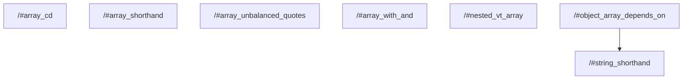

# task graph



## `<workspace>/#array_cd`

```json
{
  "task_display": {
    "package_name": "@test/task-command-shorthands",
    "task_name": "array_cd",
    "package_path": "<workspace>/"
  },
  "resolved_config": {
    "commands": [
      "vtt print before_cd",
      "cd snapshots && vtt print after_cd",
      "vtt print after_cd2"
    ],
    "resolved_options": {
      "cwd": "<workspace>/",
      "cache_config": {
        "env_config": {
          "fingerprinted_envs": [],
          "untracked_env": [
            "<default untracked envs>"
          ]
        },
        "input_config": {
          "includes_auto": true,
          "positive_globs": [],
          "negative_globs": []
        },
        "output_config": {
          "includes_auto": true,
          "positive_globs": [],
          "negative_globs": []
        }
      }
    }
  },
  "source": "TaskConfig"
}
```

## `<workspace>/#array_shorthand`

```json
{
  "task_display": {
    "package_name": "@test/task-command-shorthands",
    "task_name": "array_shorthand",
    "package_path": "<workspace>/"
  },
  "resolved_config": {
    "commands": [
      "vtt print-file package.json",
      "vtt print-file vite-task.json",
      "vtt print-file package.json"
    ],
    "resolved_options": {
      "cwd": "<workspace>/",
      "cache_config": {
        "env_config": {
          "fingerprinted_envs": [],
          "untracked_env": [
            "<default untracked envs>"
          ]
        },
        "input_config": {
          "includes_auto": true,
          "positive_globs": [],
          "negative_globs": []
        },
        "output_config": {
          "includes_auto": true,
          "positive_globs": [],
          "negative_globs": []
        }
      }
    }
  },
  "source": "TaskConfig"
}
```

## `<workspace>/#array_unbalanced_quotes`

```json
{
  "task_display": {
    "package_name": "@test/task-command-shorthands",
    "task_name": "array_unbalanced_quotes",
    "package_path": "<workspace>/"
  },
  "resolved_config": {
    "commands": [
      "foo '",
      "' bar"
    ],
    "resolved_options": {
      "cwd": "<workspace>/",
      "cache_config": {
        "env_config": {
          "fingerprinted_envs": [],
          "untracked_env": [
            "<default untracked envs>"
          ]
        },
        "input_config": {
          "includes_auto": true,
          "positive_globs": [],
          "negative_globs": []
        },
        "output_config": {
          "includes_auto": true,
          "positive_globs": [],
          "negative_globs": []
        }
      }
    }
  },
  "source": "TaskConfig"
}
```

## `<workspace>/#array_with_and`

```json
{
  "task_display": {
    "package_name": "@test/task-command-shorthands",
    "task_name": "array_with_and",
    "package_path": "<workspace>/"
  },
  "resolved_config": {
    "commands": [
      "vtt print-file package.json",
      "vtt print-file vite-task.json && vtt print-file package.json"
    ],
    "resolved_options": {
      "cwd": "<workspace>/",
      "cache_config": {
        "env_config": {
          "fingerprinted_envs": [],
          "untracked_env": [
            "<default untracked envs>"
          ]
        },
        "input_config": {
          "includes_auto": true,
          "positive_globs": [],
          "negative_globs": []
        },
        "output_config": {
          "includes_auto": true,
          "positive_globs": [],
          "negative_globs": []
        }
      }
    }
  },
  "source": "TaskConfig"
}
```

## `<workspace>/#nested_vt_array`

```json
{
  "task_display": {
    "package_name": "@test/task-command-shorthands",
    "task_name": "nested_vt_array",
    "package_path": "<workspace>/"
  },
  "resolved_config": {
    "commands": [
      "vtt print-file package.json",
      "vt run string_shorthand"
    ],
    "resolved_options": {
      "cwd": "<workspace>/",
      "cache_config": {
        "env_config": {
          "fingerprinted_envs": [],
          "untracked_env": [
            "<default untracked envs>"
          ]
        },
        "input_config": {
          "includes_auto": true,
          "positive_globs": [],
          "negative_globs": []
        },
        "output_config": {
          "includes_auto": true,
          "positive_globs": [],
          "negative_globs": []
        }
      }
    }
  },
  "source": "TaskConfig"
}
```

## `<workspace>/#object_array_depends_on`

```json
{
  "task_display": {
    "package_name": "@test/task-command-shorthands",
    "task_name": "object_array_depends_on",
    "package_path": "<workspace>/"
  },
  "resolved_config": {
    "commands": [
      "vtt print-file package.json",
      "vtt print-file vite-task.json",
      "vtt print-file package.json"
    ],
    "resolved_options": {
      "cwd": "<workspace>/",
      "cache_config": {
        "env_config": {
          "fingerprinted_envs": [],
          "untracked_env": [
            "<default untracked envs>"
          ]
        },
        "input_config": {
          "includes_auto": true,
          "positive_globs": [],
          "negative_globs": []
        },
        "output_config": {
          "includes_auto": true,
          "positive_globs": [],
          "negative_globs": []
        }
      }
    }
  },
  "source": "TaskConfig"
}
```

## `<workspace>/#string_shorthand`

```json
{
  "task_display": {
    "package_name": "@test/task-command-shorthands",
    "task_name": "string_shorthand",
    "package_path": "<workspace>/"
  },
  "resolved_config": {
    "commands": [
      "vtt print-file package.json"
    ],
    "resolved_options": {
      "cwd": "<workspace>/",
      "cache_config": {
        "env_config": {
          "fingerprinted_envs": [],
          "untracked_env": [
            "<default untracked envs>"
          ]
        },
        "input_config": {
          "includes_auto": true,
          "positive_globs": [],
          "negative_globs": []
        },
        "output_config": {
          "includes_auto": true,
          "positive_globs": [],
          "negative_globs": []
        }
      }
    }
  },
  "source": "TaskConfig"
}
```

