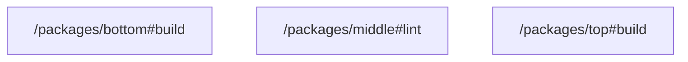

# task graph



## `<workspace>/packages/bottom#build`

```json
{
  "task_display": {
    "package_name": "@test/bottom",
    "task_name": "build",
    "package_path": "<workspace>/packages/bottom"
  },
  "resolved_config": {
    "commands": [
      "echo 'Building @test/bottom'"
    ],
    "resolved_options": {
      "cwd": "<workspace>/packages/bottom",
      "cache_config": {
        "env_config": {
          "fingerprinted_envs": [],
          "untracked_env": [
            "<default untracked envs>"
          ]
        },
        "input_config": {
          "includes_auto": true,
          "positive_globs": [],
          "negative_globs": []
        },
        "output_config": {
          "includes_auto": true,
          "positive_globs": [],
          "negative_globs": []
        }
      }
    }
  },
  "source": "PackageJsonScript"
}
```

## `<workspace>/packages/middle#lint`

```json
{
  "task_display": {
    "package_name": "@test/middle",
    "task_name": "lint",
    "package_path": "<workspace>/packages/middle"
  },
  "resolved_config": {
    "commands": [
      "echo 'Linting @test/middle'"
    ],
    "resolved_options": {
      "cwd": "<workspace>/packages/middle",
      "cache_config": {
        "env_config": {
          "fingerprinted_envs": [],
          "untracked_env": [
            "<default untracked envs>"
          ]
        },
        "input_config": {
          "includes_auto": true,
          "positive_globs": [],
          "negative_globs": []
        },
        "output_config": {
          "includes_auto": true,
          "positive_globs": [],
          "negative_globs": []
        }
      }
    }
  },
  "source": "PackageJsonScript"
}
```

## `<workspace>/packages/top#build`

```json
{
  "task_display": {
    "package_name": "@test/top",
    "task_name": "build",
    "package_path": "<workspace>/packages/top"
  },
  "resolved_config": {
    "commands": [
      "echo 'Building @test/top'"
    ],
    "resolved_options": {
      "cwd": "<workspace>/packages/top",
      "cache_config": {
        "env_config": {
          "fingerprinted_envs": [],
          "untracked_env": [
            "<default untracked envs>"
          ]
        },
        "input_config": {
          "includes_auto": true,
          "positive_globs": [],
          "negative_globs": []
        },
        "output_config": {
          "includes_auto": true,
          "positive_globs": [],
          "negative_globs": []
        }
      }
    }
  },
  "source": "PackageJsonScript"
}
```

