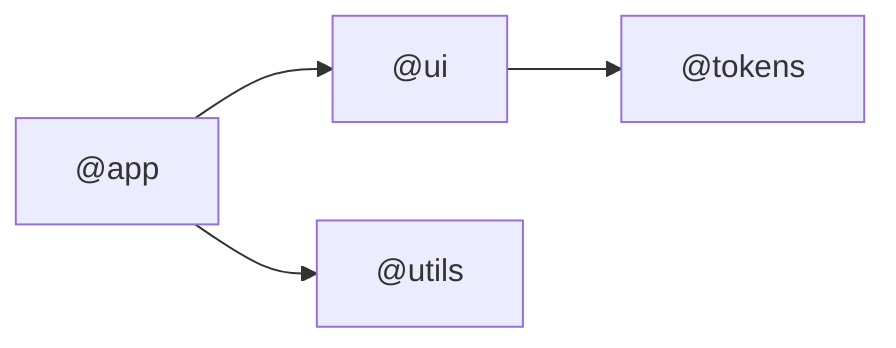
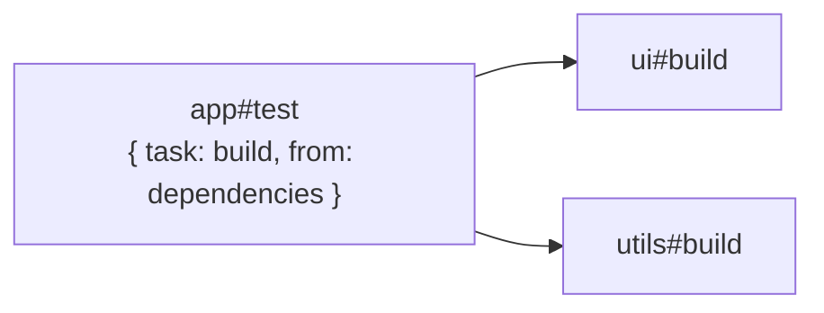
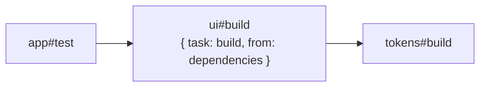

# RFC: `dependsOn` Package Dependency Selection

## Summary

Add an object form for `dependsOn` that runs a task in direct workspace dependency packages without using special-character task syntax.

```ts
type DependencyType = 'dependencies' | 'devDependencies' | 'peerDependencies';

type DependsOnEntry =
  | string
  | {
      task: string;
      from: DependencyType | DependencyType[];
    };
```

String entries keep their current behavior:

```jsonc
{
  "dependsOn": ["build"],
}
```

Object entries select direct dependency packages from `package.json` fields:

```jsonc
{
  "dependsOn": [{ "task": "build", "from": "dependencies" }],
}
```

## Motivation

This is feature parity with Turborepo and Nx.

Both tools have a common way to say: before running this task, run a task with the same or chosen name in dependency packages. That pattern is used for builds, type generation, tests that need built libraries, and other upstream artifact pipelines.

Without it, migrating a repo from Turbo or Nx requires replacing a common task pipeline feature with manual package-specific `dependsOn` entries. That is noisy and easy to get wrong. For many repos, this is essential migration coverage.

The proposed form keeps the behavior explicit while avoiding special characters like `^` in task config.

## Comparison

| Case                                                       | Turborepo                 | Nx                                                          | This proposal                                                 |
| ---------------------------------------------------------- | ------------------------- | ----------------------------------------------------------- | ------------------------------------------------------------- |
| Run `build` in direct dependency packages before this task | `"^build"`                | `"^build"` or `{ "dependencies": true, "target": "build" }` | `{ "task": "build", "from": "dependencies" }`                 |
| Dependency field selection                                 | Not expressed in `^build` | Not expressed in `^build` / `dependencies: true`            | `from`: `dependencies`, `devDependencies`, `peerDependencies` |

## Semantics

An object entry runs a task in direct dependency packages of the package that declares the source task.

For:

```jsonc
{
  "tasks": {
    "test": {
      "command": "vitest run",
      "dependsOn": [{ "task": "build", "from": "dependencies" }],
    },
  },
}
```

running `app#test` means:

1. Start at package `app`.
2. Select its direct workspace dependencies declared in `dependencies`.
3. In each selected package, run `build` if that package has a `build` task.

The source package itself is not selected by the object entry.

Package dependencies:



Task dependencies:



In this example:

- `app#test` depends on `ui#build`.
- `app#test` depends on `utils#build`.
- `tokens#build` is not selected by this entry because `@tokens` is not a direct dependency of `@app`.
- `app#test` does not imply `app#build`; same-package dependencies use string form.

## Not Recursive

An object entry is not recursive. It selects only direct dependency packages.

In the graph above, `tokens#build` is not selected by `app#test` because `@tokens` is a dependency of `@ui`, not `@app`.

If `ui#build` declares its own `{ "task": "build", "from": "dependencies" }`, then `tokens#build` can be selected from `ui#build`. That is a separate dependency declaration, not recursion from `app#test`.

Package dependencies:


Task dependencies:



## `from`

`from` names the package.json dependency fields used to select direct dependency packages.

```jsonc
{ "task": "build", "from": "dependencies" }
```

This selects direct dependencies from `dependencies`.

```jsonc
{ "task": "build", "from": ["dependencies", "devDependencies"] }
```

This selects the union of direct dependencies from `dependencies` and `devDependencies`.

Supported values are:

- `dependencies`
- `devDependencies`
- `peerDependencies`

If the same direct dependency package is selected through more than one allowed field, it is included once.
